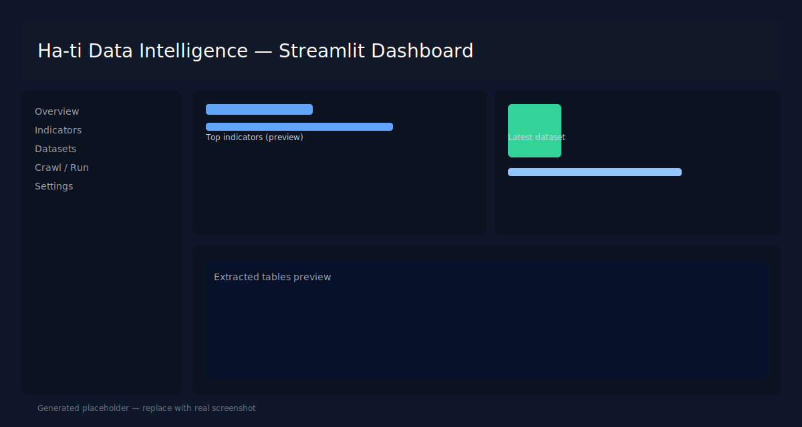

# Ha-ti Data Intelligence



## Résumé

Ha-ti Data Intelligence est une pipeline de collecte, extraction et ingestion de données publiques (BRH — Banque de la République d'Haïti). Le projet automatise la navigation JS-heavy des sites (reproduction des clics), télécharge les ressources finales (PDF / Excel / CSV / HTML), extrait les tableaux, et ingère les valeurs agrégées dans une base analytique.

Objectifs clés:
- Automatiser la découverte des indicateurs publiés par la BRH.
- Extraire et normaliser les séries temporelles et tables tabulaires.
- Ingester les données extraites dans une base PostgreSQL pour analyses et visualisation.

## Capture d'écran

La capture ci-dessus est un placeholder; remplacez `assets/streamlit_dashboard.svg` par une capture réelle du dashboard Streamlit pour obtenir un rendu final professionnel.

## Fonctionnalités

- Navigator Playwright pour reproduire les interactions JS (menus, boutons).
- Crawler priorisé qui découvre et télécharge ressources finales.
- Processors: extraction PDF (pdfplumber), Excel, HTML -> CSV.
- Ingestion automatique dans la base (modèles SQLAlchemy).
- API FastAPI exposant les indicateurs découverts et endpoints d'opération.
- Frontend Streamlit pour exploration et dashboarding.

## Architecture du projet

La structure principale du dépôt:

- `backend/` — API FastAPI, routes, configuration.
- `data_ingestion/` — extractors, crawler, downloader, processors, ingestion helpers.
- `data/` — données en sortie: `raw/`, `processed/tables`, `processed/text`, `chroma_db`.
- `frontend/` — Streamlit app et composants UI.
- `scripts/` — utilitaires et scripts d'appoint (ex: `process_downloads.py`).
- `docs/` — documents de conception, spécifications et roadmap.

Mermaid (high-level) architecture:

```mermaid
flowchart TB
  A[Playwright Navigator]
  B[Crawler & Downloader]
  C[Processors (PDF/Excel/HTML)]
  D[Processed CSVs/Text]
  E[Ingestion -> PostgreSQL]
  F[FastAPI]
  G[Streamlit Dashboard]

  A --> B --> C --> D --> E
  E --> F --> G
  D --> G
```

## Installation rapide

Pré-requis: Python 3.9+, PostgreSQL.

1. Créez et activez un venv:

```bash
python -m venv .venv
source .venv/bin/activate  # Linux/macOS
.venv\Scripts\Activate.ps1 # Windows PowerShell
```

2. Installez les dépendances:

```bash
pip install -r requirements.txt
python -m playwright install
```

3. Configurez la base de données dans `backend/config` (variables d'environnement ou fichier `config.py`).

## Exécution

Démarrer le backend (FastAPI):

```bash
uvicorn backend.api.main:app --host 127.0.0.1 --port 8000 --reload
```

Démarrer le frontend (Streamlit):

```bash
python -m streamlit run frontend/app.py --server.port 8501
```

Lancer le crawler (exemples):

```bash
python -m data_ingestion.extractors.brh.pipeline --run-crawl
```

Traitement des téléchargements existants et ingestion:

```bash
python scripts/process_downloads.py
```

## API utiles

- `GET /data/brh-indicators` — liste des indicateurs découverts.
- `POST /data/refresh-brh` — relance le crawl/extraction (protégé selon config).

## Remarques professionnelles

- Remplacez le placeholder d'image par une vraie capture haute résolution (PNG/WEBP) pour la page principale.
- Ajoutez CI (tests unitaires + lint) et badge de build dans le `README` si vous intégrez GitHub Actions.
- Sensible: évitez de pousser des credentials dans `config.py`; préférez variables d'environnement.

## Contribution

1. Fork
2. Branche feature
3. PR avec description et tests

## Licence

MIT — voir `LICENSE` (ajoutez si nécessaire).

---

Si vous voulez, je peux:
- générer une capture d'écran réelle du Streamlit en local et l'insérer dans `assets/` (nécessite d'exécuter Streamlit ici), ou
- créer un badge GitHub Actions CI et ajouter un workflow minimal.

Dites-moi ce que vous préférez.
# Haiti Data Intelligence (HDI)

**Haiti Data Intelligence** est une plateforme d'analyse et de veille stratégique B2B dédiée à l'économie d'Haïti. Elle combine l'intelligence artificielle générative (RAG) et l'analyse de données structurées (SQL) pour fournir des insights fiables et sourcés.

---

## 🚀 Vue d'ensemble

Le projet vise à résoudre l'asymétrie d'information sur le marché haïtien en automatisant la collecte, le traitement et l'analyse des données provenant de sources institutionnelles (BRH, IHSI, Banque Mondiale, FMI).

### Fonctionnalités Clés
- **Assistant Chat Intelligent** : Interrogation en langage naturel via une architecture hybride RAG/SQL.
- **Tableaux de Bord Macroéconomiques** : Visualisation interactive des indicateurs (Inflation, PIB, Change).
- **Briefing Automatique** : Génération de rapports profilés (ONG, Investisseur, Analyste).
- **Traçabilité Totale** : Citations automatiques des documents sources originaux (ID du document, Page).
- **Observabilité & Qualité** : Monitoring en temps réel de la santé système et de la fiabilité des données.

---

## 🏗️ Architecture Technique

Le système repose sur une architecture en couches découplées :

1.  **Pipeline d'Ingestion (ETL)** : Modules Python pour l'extraction (APIs & Scrapers) et la normalisation.
2.  **Couche de Persistance** : 
    - **PostgreSQL** : Données transactionnelles et séries temporelles.
    - **ChromaDB** : Base vectorielle pour l'indexation sémantique des documents.
3.  **Backend API (FastAPI)** : Moteur de services (Analytics, RAG, Briefing, Monitoring).
4.  **Frontend (Streamlit)** : Interface utilisateur MVP orientée usage analytique.

---

## 📁 Structure du Repository

```text
haiti-data-intelligence/
├── data_ingestion/      # Extraction des données (ETL) et normalisation
├── backend/             # Cœur logique
│   ├── api/             # Contrôleurs et routes FastAPI
│   ├── core/            # Configuration, logging et sécurité
│   ├── db/              # Connecteurs PostgreSQL et ChromaDB
│   ├── models/          # Modèles de données (SQLAlchemy & Pydantic)
│   └── services/        # Moteurs : Analytics, RAG, Briefing, Router
├── frontend/            # Interface UI Streamlit
│   └── components/      # Visualisations et widgets réutilisables
├── data/                # Stockage local (PDFs, DB Files - Dev uniquement)
├── tests/               # Suite de tests (Unit, Integration, API)
├── docs/                # Stratégies détaillées et guide métier
└── .env                 # Configuration des secrets
```

---

## 🛠️ Installation et Exécution

### Prérequis
- Python 3.10+
- PostgreSQL
- Clé OpenAI API

### Installation
1.  **Cloner le projet**
2.  **Créer un environnement virtuel** :
    ```powershell
    python -m venv venv
    .\venv\Scripts\activate
    ```
3.  **Installer les dépendances** :
    ```powershell
    pip install -r requirements.txt
    ```
4.  **Configurer les variables d'environnement** :
    Copiez `.env.example` vers `.env` et renseignez vos clés.

### Lancement
1.  **Démarrer le Backend** :
    ```powershell
    uvicorn backend.api.main:app --reload
    ```
2.  **Démarrer le Frontend** :
    ```powershell
    streamlit run frontend/app.py
    ```
3.  **Lancer une ingestion (Initialisation)** :
    ```powershell
    python -m data_ingestion.main
    ```

---

## 🧪 Stratégie de Tests

HDI utilise `pytest` pour assurer la robustesse du système :
- **Tests Unitaires** : Logic de calcul et validation.
- **Tests d'Intégration** : Pipeline Ingestion -> DB.
- **Tests API** : Validation des endpoints et des contrats de données.

Exécution : `pytest tests/`

---

## 🛡️ Garde-fous & Robustesse
- **Sanitisation** : Protection contre l'injection de prompt.
- **Mode Dégradé** : Fallbacks automatiques si un service tiers (OpenAI, Chroma) échoue.
- **Audit Quality** : Logging systématique des anomalies de données dès l'ingestion.

---

## 🗺️ Roadmap Technique

- **Q2 2024** : Implémentation du SQL Agent (Text-to-SQL) pour l'autonomie analytique.
- **Q3 2024** : Exportation de rapports complexes au format PDF/HTML personnalisé.
- **Q4 2024** : Dockerisation complète et déploiement Cloud (CI/CD).

---

## 🤝 Contribution
1.  Créez une branche thématique (`feature/` ou `fix/`).
2.  Assurez-vous que les tests passent.
3.  Documentez toute nouvelle fonction via une docstring et un walkthrough dans `brain/`.
