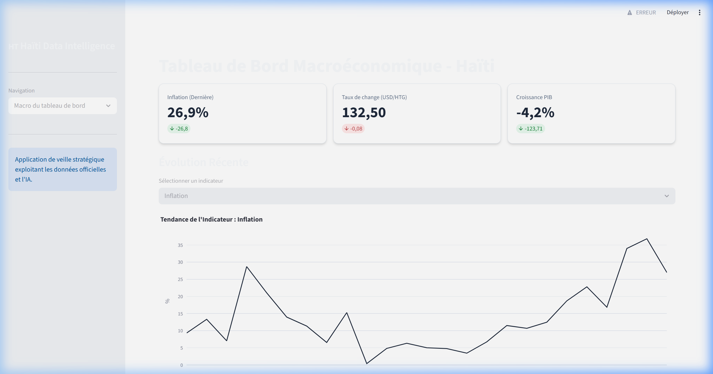
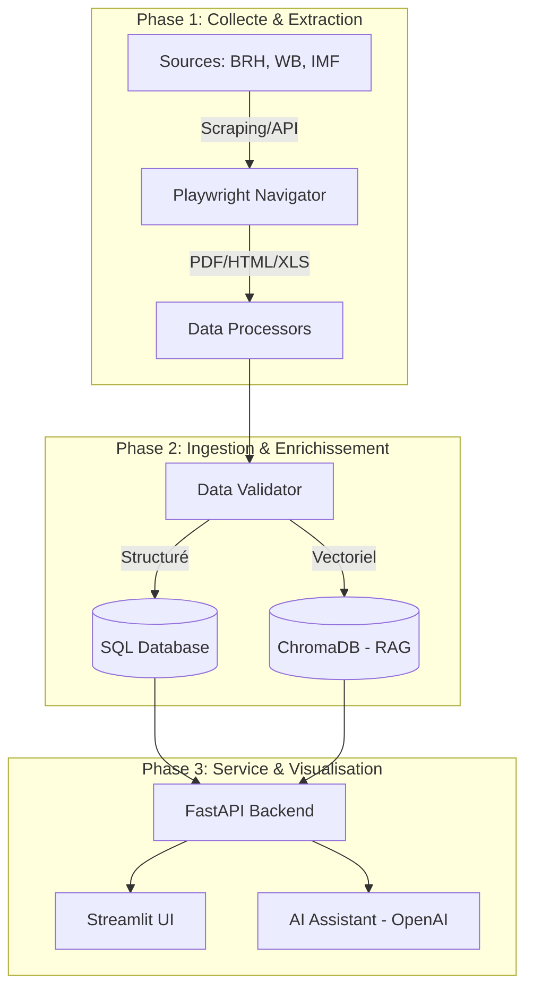

<p align="center">
  
</p>

# 🇭🇹 Haiti Data Intelligence (HDI)

**La plateforme de veille stratégique et d'analyse macroéconomique augmentée par l'IA pour la région Caraïbes.**

[](https://opensource.org/licenses/MIT)
[](https://www.python.org/downloads/)
[](https://fastapi.tiangolo.com/)
[](https://streamlit.io/)

---

## 🚀 Vision du Projet

**Haiti Data Intelligence (HDI)** est une plateforme B2B innovante conçue pour transformer la manière dont les analystes, les décideurs et les chercheurs accèdent aux données économiques d'Haïti et de ses voisins. 

En combinant une **pipeline d'extraction automatisée** (Web Scraping & OCR PDF), une **base de données analytique structurée** (PostgreSQL/SQLite), et une **IA conversationnelle (RAG)**, HDI offre une réponse immédiate aux questions économiques complexes, là où la recherche manuelle prenait auparavant des heures.

---

## 📸 Aperçu de l'Interface


*Interface principale : Visualisation des taux de change (BRH), inflation et croissance du PIB en temps réel.*

---

## ✨ Fonctionnalités Clés

- **🤖 Assistant IA RAG** : Posez des questions en langage naturel ("Quelle est la tendance de l'inflation sur 6 mois ?") et obtenez des réponses sourcées combinant données SQL et documents PDF.
- **📡 Extraction Multimode** :
  - **Sites Institutionnels** : Scraping profond de la BRH, Banque Mondiale et FMI.
  - **Documents non-structurés** : Extraction automatique de tableaux depuis les rapports financiers (PDF/Excel) via Playwright et pdfplumber.
- **📊 Dashboard Analytique** : Visualisation dynamique des indicateurs macroéconomiques (PIB, Inflation, Change, Réserves).
- **🛠 Orchestration Robuste** : Système d'ingestion résilient avec validation automatique des données et gestion des doublons.

---

## 🏗 Architecture du Système

### Flux de Données Global
HDI utilise une architecture moderne découplée pour garantir performance et scalabilité.



### Architecture Technique
Le projet suit les principes de **Clean Architecture** :
- **Backend** : FastAPI pour une performance asynchrone optimale.
- **Stockage** : SQLite pour le MVP (évolutif vers PostgreSQL) + ChromaDB pour le vector store.
- **Frontend** : Streamlit pour un déploiement rapide et réactif.
- **IA** : Intégration avancée avec l'API OpenAI (GPT-4o-mini & Embeddings).

---

## 🛠 Installation & Configuration

### Pré-requis
- Python 3.9+ 
- Une clé API OpenAI (`OPENAI_API_KEY`)

### Installation Rapide
1. **Cloner le repository** :
   ```bash
   git clone https://github.com/Denart97/Ha-ti-Data-Intelligence.git
   cd Ha-ti-Data-Intelligence
   ```

2. **Créer l'environnement virtuel** :
   ```bash
   python -m venv venv
   source venv/bin/activate  # Sur Windows: venv\Scripts\activate
   ```

3. **Installer les dépendances** :
   ```bash
   pip install -r requirements.txt
   python -m playwright install
   ```

4. **Configuration** :
   Créez un fichier `.env` à la racine basé sur `.env.example`.
   ```bash
   cp .env.example .env
   # Éditez le fichier .env avec votre clé API OpenAI
   ```

---

## 🚦 Exécution

### 1. Démarrer le Serveur Backend
```bash
uvicorn backend.api.main:app --host 0.0.0.0 --port 8000 --reload
```

### 2. Lancer le Dashboard Frontend
Dans un nouveau terminal :
```bash
streamlit run frontend/app.py
```

L'application sera accessible sur `http://localhost:8501`.

---

## 🗺 Roadmap

- [x] **Phase 1** : Pipeline d'extraction BRH & Dashboard MVP.
- [x] **Phase 2** : Intégration AI RAG & Assistant Conversationnel.
- [ ] **Phase 3** : Module de comparaison régionale (Haïti vs Rép. Dominicaine/Jamaïque).
- [ ] **Phase 4** : Export de rapports PDF automatisés pour les investisseurs.

---

## 🤝 Contribution

Les contributions sont les bienvenues ! 
1. Forkez le projet.
2. Créez votre branche de fonctionnalité (`git checkout -b feature/AmazingFeature`).
3. Committez vos changements (`git commit -m 'Add AmazingFeature'`).
4. Pushez vers la branche (`git push origin feature/AmazingFeature`).
5. Ouvrez une Pull Request.

---

## 📄 Licence

Distribué sous la licence MIT. Voir `LICENSE` pour plus d'informations.

---

<p align="center">
  Développé avec ❤️ pour l'avenir économique d'Haïti.
</p>
